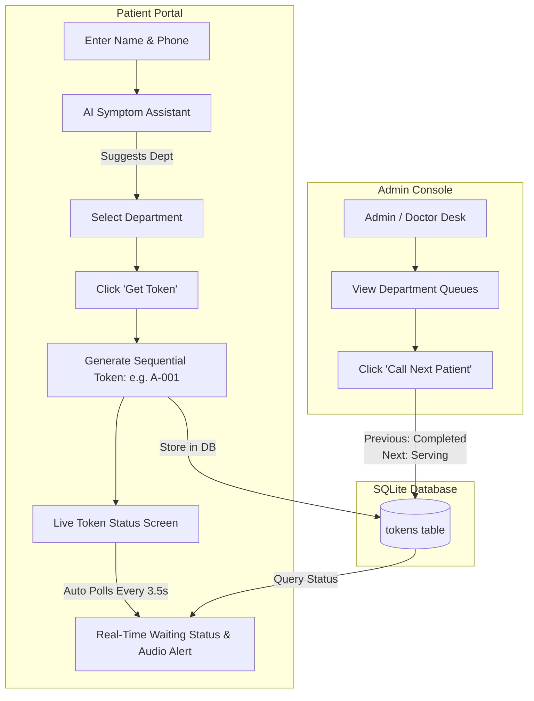

# 🏥 QueueCare – Smart Hospital Token System

[](https://www.python.org/)
[](https://palletsprojects.com/p/flask/)
[](https://www.sqlite.org/)
[]()
[]()

> **QueueCare** is a clean, modern, and contactless Outpatient Department (OPD) token and queue management system designed for hospitals and healthcare clinics. Built specifically for high-speed hackathons with zero external API dependencies.

---

## 🌟 Key Highlights

- 🎫 **Instant Token Generation**: Generates department-specific token identifiers (`A-001`, `B-001`, `C-001`, `D-001`).
- 🤖 **Rule-Based AI Department Recommendation**: Automatically analyzes patient symptoms (e.g. *"I have severe knee pain"*) and suggests the appropriate hospital department (e.g. *Orthopedics*).
- 📲 **Live Digital Token Screen**: Real-time polling updates patients on their queue position, currently serving token, and people ahead without reloading.
- 🛡️ **Hospital Admin Console**: OPD desk/doctor view to monitor live queues, call next patients, and review consultation history.
- 🔊 **Audio Chimes**: Web Audio chime sounds when a patient's token is called for consultation.
- ⚡ **Zero External APIs & Zero Heavy Frameworks**: Self-contained SQLite database that auto-initializes on first launch.

---

## 🏗️ System Architecture & Workflow



---

## 🩺 Supported Hospital Departments

| Department | Token Prefix | Typical Symptoms Covered |
| :--- | :---: | :--- |
| **General Medicine** | `A-000` | Fever, cold, cough, headache, viral flu, general weakness |
| **Cardiology** | `B-000` | Chest pain, palpitations, hypertension, shortness of breath |
| **Orthopedics** | `C-000` | Knee pain, fractures, joint aches, back pain, sprains |
| **Pediatrics** | `D-000` | Infant health, child fever, vaccinations, teething |

---

## 📂 Project Structure

```text
QueueCare/
├── app.py                  # Flask server, routing, SQLite initialization & AI engine
├── requirements.txt        # Flask dependency
├── database.db             # SQLite database (auto-generated)
├── .gitignore              # Git ignore rules
├── README.md               # Documentation
├── templates/
│   ├── index.html          # Patient booking & AI symptom recommendation
│   ├── token.html          # Digital token display & live queue tracking
│   └── admin.html          # Admin OPD consultation desk
└── static/
    ├── style.css           # Clean healthcare theme styling
    └── script.js           # Client-side AI interaction & live polling
```

---

## 🚀 Quick Start Guide

### 1. Prerequisites
Ensure you have **Python 3.10+** installed on your system.

### 2. Clone the Repository
```bash
git clone https://github.com/<your-username>/QueueCare.git
cd QueueCare
```

### 3. Install Dependencies
```bash
pip install -r requirements.txt
```

### 4. Run the Application
```bash
python app.py
```

Open your browser and navigate to:
- **Patient Portal:** [http://127.0.0.1:5000](http://127.0.0.1:5000)
- **Admin Dashboard:** [http://127.0.0.1:5000/admin](http://127.0.0.1:5000/admin)

---

## 📱 Features Walkthrough

### 1. Patient Portal (`/`)
1. Enter your name and 10-digit mobile number.
2. *(Optional)* Type your symptoms into the **AI Assistant** (e.g. *"I twisted my ankle playing football"*) and click **✨ Recommend**.
3. Click **Select This Department** to auto-select the recommended department.
4. Click **Get Token Now** to receive your sequential digital token.

### 2. Live Token Tracker (`/token/<TOKEN_ID>`)
- Displays your digital token number in a high-contrast glowing card.
- Shows **Currently Serving** token and exact **People Ahead** in line.
- Progress tracker displays stages: `Registered ➔ In Waiting Queue ➔ With Doctor ➔ Completed`.
- Automatically plays an alert chime when called.

### 3. Admin Console (`/admin`)
- Select any department tab to see its waiting room.
- Click **Call Next Patient**:
  - Automatically transitions the active patient to `Completed`.
  - Promotes the first waiting patient to `Serving`.
- Click **⚡ Load Demo Data** to populate realistic sample patients for instant presentations.

---

## 🌐 REST API Endpoints

| Method | Endpoint | Description |
| :--- | :--- | :--- |
| `POST` | `/api/recommend` | Rule-based symptom analysis returning recommended department |
| `GET` | `/api/token/<token_number>` | JSON status of a token (status, currently serving, people ahead) |
| `GET` | `/api/admin/queue/<department>` | JSON queue status for live admin monitoring |
| `POST` | `/admin/call-next` | Advances the queue for a specified department |

---

## 📄 License

This project is licensed under the [MIT License](LICENSE). Built for hackathons, educational demonstrations, and healthcare prototypes.
